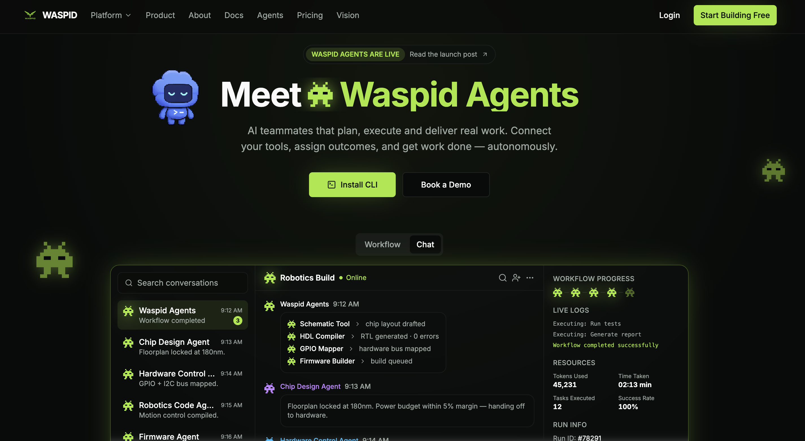
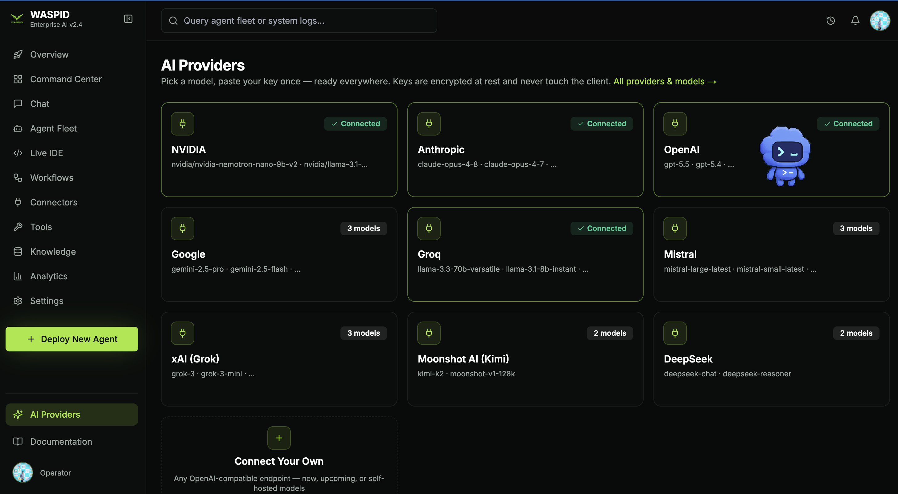
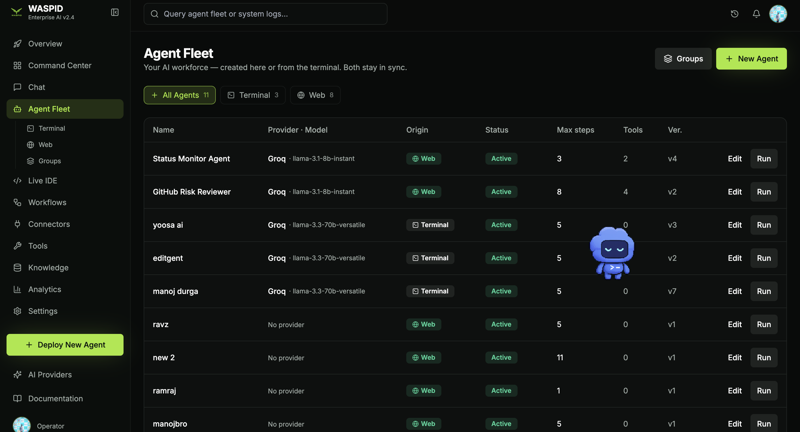
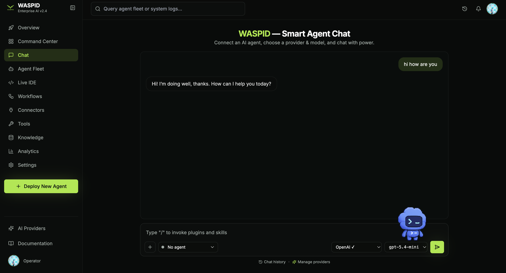
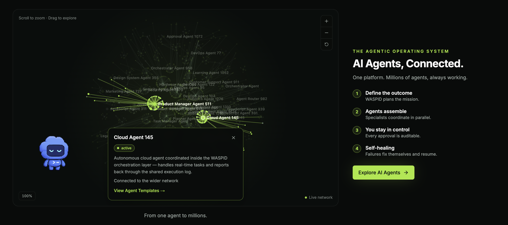
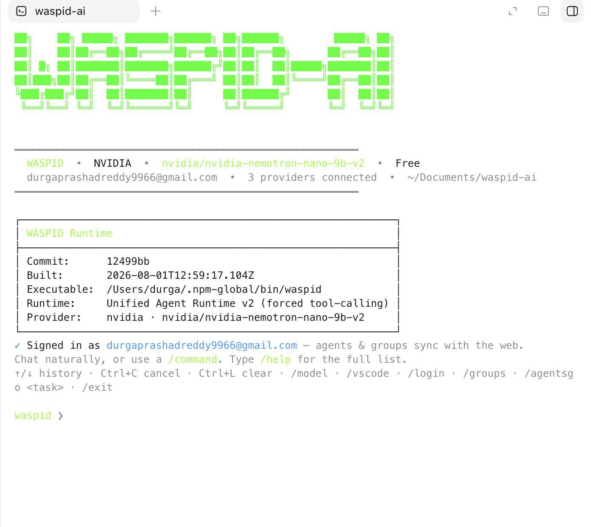

<!-- Waspid AI OS -->
<a name="readme-top"></a>

<div align="center">
  <h1 align="center" style="border-bottom: none">Waspid</h1>
  <h3 align="center" style="border-bottom: none">Enterprise AI Workforce Operating System</h3>
</div>

<div align="center">
  <a href="LICENSE"></a>
  <a href="enterprise/LICENSE"></a>
  
  
</div>

<hr>

**Waspid** is an enterprise **AI Workforce Operating System** for building,
deploying, orchestrating, and managing AI agents. Create real AI workers for
software engineering, support, sales, marketing, research, operations, hardware,
robotics, YouTube, social media, and custom business workflows from one synced
platform.

Waspid is built as its own product and brand. The public README, product
language, CLI, dashboard, and documentation are Waspid-first.

Bring your most-used **ChatGPT**, **OpenAI**, and **Codex** workflows into one
workspace. Connect multiple model providers once, select the best model per
agent, and run fleets of agents across the web dashboard, terminal CLI, and
developer tools with realtime sync.

<p align="center">
  
</p>

## Table of Contents

- [Why Waspid](#why-waspid)
- [Product Screens](#product-screens)
- [What You Can Build](#what-you-can-build)
- [Platform Highlights](#platform-highlights)
- [AI Agents](#ai-agents)
- [Multi-Agent Orchestration](#multi-agent-orchestration)
- [OpenAI, ChatGPT, and Codex](#openai-chatgpt-and-codex)
- [Supported AI Providers](#supported-ai-providers)
- [Tool Marketplace](#tool-marketplace)
- [Runtime and Self-Healing](#runtime-and-self-healing)
- [Security and Trust](#security-and-trust)
- [Repository Structure](#repository-structure)
- [Running Locally](#running-locally)
- [Documentation](#documentation)
- [Licensing](#licensing)

## Why Waspid

Most AI tools are single chats. Waspid turns AI into an operating system for
work: named agents, reusable prompts, model routing, tool access, execution
history, approvals, versioning, teams, and observability.

- **AI workforce dashboard** - deploy, monitor, and manage fleets of agents
  the way you manage employees.
- **OpenAI and Codex highlighted** - use Codex as a first-class engineering
  worker for code, tests, reviews, debugging, documentation, release notes, and
  production maintenance.
- **Connect multi-model providers once** - add OpenAI, Anthropic, NVIDIA,
  Google, Groq, Mistral, xAI, DeepSeek, Moonshot, or your own compatible
  endpoint one time, then use those providers everywhere.
- **Per-agent model selection** - each agent can run on its own provider and
  model, so a coding agent, support agent, and marketing agent can all use the
  right model for their job.
- **Multi-agent teams** - group specialists together so planning, execution,
  review, and reporting can happen in parallel.
- **Human control** - approvals, audit logs, versioning, and pause/resume
  controls keep autonomy accountable.
- **Realtime sync** - web, terminal, and developer workflows stay connected to
  the same account and shared backend state.

## Product Screens

<p align="center">
  
</p>

Connect every model provider once and switch models per agent or per chat.
Waspid keeps provider configuration centralized so teams can use ChatGPT,
Codex, OpenAI, Claude, Gemini, Groq, NVIDIA, Mistral, DeepSeek, xAI, Kimi, and
self-hosted models without copying keys into every workflow.

<p align="center">
  
</p>

Run a live fleet of terminal, web, and workflow agents. Track status, provider,
model, tools, versions, origins, and run history from the same command center.

<p align="center">
  
</p>

Chat with an agent directly, invoke skills and tools, switch providers, and
keep human control over the execution path.

<p align="center">
  
</p>

Scale from one agent to a connected operating system: define the outcome, let
specialists assemble, and keep every approval auditable.

<p align="center">
  
</p>

Use the `waspid` CLI for local agent work, provider selection, project setup,
chat, and terminal-first execution.

## What You Can Build

Waspid is for creating any agent your team needs, not only coding agents.

| Agent type | Example use cases |
| --- | --- |
| **Codex engineering agents** | Code changes, bug fixes, test writing, PR reviews, migrations, docs, release tasks |
| **Social media agents** | Plan content calendars, draft posts, schedule campaigns, adapt tone per platform |
| **YouTube agents** | Research topics, write scripts, generate titles, create outlines, prepare descriptions |
| **Hardware agents** | Board bring-up notes, HDL review, firmware checklists, test report generation |
| **Robotics agents** | Motion-control planning, sensor logs, simulation summaries, hardware handoff workflows |
| **Support agents** | Ticket triage, knowledge-base answers, billing workflows, customer escalation summaries |
| **Sales agents** | Lead qualification, account research, outreach drafts, CRM updates |
| **Research agents** | Web research, report writing, source comparison, market intelligence |
| **Operations agents** | Status monitoring, incident summaries, runbooks, recurring business processes |
| **Custom agents** | Any specialized worker with its own prompt, model, tools, permissions, and max-step budget |

## Platform Highlights

| Capability | What it means |
| --- | --- |
| **AI Agent Platform** | Create, edit, deploy, pause/resume, archive, version, and run agents. |
| **Multi-Agent System** | Group agents and run them collaboratively on one task. |
| **AI Marketplace** | Deploy ready support and workflow agents into an account. |
| **Agent Templates** | Start from templates across support, sales, engineering, marketing, HR, operations, and research. |
| **Tool Marketplace** | Connect tools once, assign only the tools each agent needs, and keep permissions visible. |
| **Multi-Provider AI** | Use OpenAI, Anthropic, NVIDIA, Google, Groq, Mistral, xAI, DeepSeek, Moonshot, or a custom endpoint. |
| **Agentic Runtime** | Multi-step execution with dynamic tool calling, retries, cost tracking, and event streaming. |
| **Self-Healing** | Failed executions can be diagnosed, proposed fixes can be approved, and runs can resume. |
| **CLI** | Terminal workspace, chat REPL, provider setup, and management commands. |
| **Web Dashboard** | Command Center, Agent Fleet, Chat, Workflows, Connectors, Tools, Knowledge, Analytics, and Settings. |
| **Realtime Sync** | Agents, groups, runs, and status updates stay synced across surfaces. |
| **Enterprise Controls** | Organizations, roles, billing, auditability, integrations, and encrypted credentials. |

## AI Agents

An agent is a reusable AI worker with:

- **Name and identity** - a clear role such as "Codex PR Reviewer" or
  "YouTube Script Agent".
- **System prompt** - the agent's operating instructions.
- **Provider and model** - OpenAI, Anthropic, Groq, NVIDIA, Google, Mistral,
  DeepSeek, xAI, Moonshot, or custom endpoints.
- **Tools** - file access, terminal, git, browser, web search, API calls,
  spreadsheets, email, calendar, CRM, database, and utility tools.
- **Max steps** - a turn budget for reasoning and tool use.
- **Status** - active, paused, archived, or deployed.
- **Version** - every meaningful edit can be tracked.

Agents can be created from the dashboard, terminal, templates, marketplace, or
API. They run through the same backend execution engine, so behavior is
consistent everywhere.

## Multi-Agent Orchestration

Waspid is built for teams of agents:

- **Groups** - assemble multiple agents around a task or business function.
- **Specialists** - give each agent a focused role, model, and tool set.
- **Parallel work** - let agents research, code, review, test, summarize, and
  report in coordinated flows.
- **Shared memory and history** - keep execution history, logs, and artifacts
  available for review.
- **Human approvals** - decide where autonomy stops and human review begins.

Example teams:

- **Software team** - Codex coding agent, test agent, release-note agent, PR
  reviewer, and incident-summary agent.
- **Content team** - YouTube research agent, script agent, social media agent,
  SEO agent, and publishing checklist agent.
- **Hardware team** - firmware agent, robotics agent, GPIO mapping agent,
  hardware-control agent, and report agent.
- **Customer team** - triage agent, knowledge agent, billing agent, escalation
  agent, and success-summary agent.

## OpenAI, ChatGPT, and Codex

OpenAI is a first-class provider in Waspid. Use OpenAI models for general
reasoning, content, automation, and production workflows, and use Codex-style
agents for software engineering tasks.

Codex is especially useful for:

- Reading and editing code.
- Writing and fixing tests.
- Debugging failures.
- Refactoring modules.
- Reviewing pull requests.
- Explaining technical systems.
- Preparing release notes and migration guides.
- Running repeatable engineering workflows as named agents.

Waspid keeps those workflows reusable: create the agent once, connect the model
once, assign tools once, then run it from the dashboard, chat, CLI, or API.

## Supported AI Providers

| Provider | Example models | Best for |
| --- | --- | --- |
| **OpenAI** | GPT and reasoning models | ChatGPT-style work, Codex workflows, general-purpose agents |
| **Anthropic** | Claude models | Careful reasoning, analysis, long-form work, complex code review |
| **NVIDIA** | Nemotron and NIM-hosted models | Enterprise model hosting and high-throughput workloads |
| **Google Gemini** | Gemini Pro and Flash models | Long context, fast multimodal and general workloads |
| **Groq** | Llama and Mixtral models | Ultra-fast inference and high-throughput agent tasks |
| **Mistral** | Large, Small, Codestral | Efficient agents and code-specialized workflows |
| **xAI** | Grok models | General reasoning and vision-capable workflows |
| **Moonshot AI** | Kimi models | Long-context analysis |
| **DeepSeek** | Chat and reasoning models | Strong reasoning value |
| **Custom endpoint** | OpenAI-compatible APIs | Self-hosted, private, or upcoming models |

## Tool Marketplace

Waspid agents become useful when they can act. The tool layer is designed for
least-privilege operation: connect tools centrally, then assign only what a
specific agent needs.

| Category | Examples |
| --- | --- |
| **Developer** | File read/list/edit, terminal, git, code workflows |
| **Knowledge** | Web search, browser, PDF reader, knowledge base |
| **Business** | HTTP APIs, webhooks, CRM, database |
| **Communication** | Gmail, Outlook, Slack |
| **Productivity** | Calendar, sheets, drive |
| **Utility** | Calculator, current time, JSON extraction |

Credentials are encrypted server-side, never displayed back to the client, and
not injected into model prompts as raw secrets.

## Runtime and Self-Healing

Every run uses the same execution engine:

- Resolve the agent's provider, model, tools, and permissions.
- Stream execution events in realtime.
- Let the model call only the tools enabled for that agent.
- Retry transient failures with backoff.
- Persist steps, output, status, duration, and cost.
- Surface clear errors when credentials or tools are missing.
- Support approval-based recovery when a run needs human review.

The self-healing loop can diagnose a failed execution, propose a fix, request
approval, and resume from the failed point once approved.

## Security and Trust

Waspid is designed for production teams that need control:

- **Encrypted credentials** for provider keys, tool credentials, and secrets.
- **Least-privilege tools** so each agent only gets the capabilities assigned
  to it.
- **Auditability** through execution history, versions, run status, and logs.
- **Human approvals** for sensitive or corrective actions.
- **Multi-tenant structure** for organizations, roles, billing, and isolated
  account data.
- **Operational visibility** through analytics, logs, and realtime status.

## Repository Structure

| Path | Purpose |
| --- | --- |
| [`waspid/`](waspid) | Core Python backend and agent control plane. |
| [`enterprise/`](enterprise) | Multi-tenant SaaS layer: auth, billing, organizations, integrations, sharing, migrations. |
| [`frontend/`](frontend) | React dashboard: command center, fleet, chat, providers, tools, analytics, and settings. |
| [`waspid-ui/`](waspid-ui) | Shared React component library for Waspid UI. |
| [`containers/`](containers) | Production and development container images. |
| [`docs/`](docs) | Installation, API, architecture, security, workflows, and product documentation. |
| [`config.template.toml`](config.template.toml) | Reference runtime, sandbox, MCP, and deployment configuration. |

## Running Locally

Install the full project:

```bash
make build
```

Run the app locally:

```bash
make run
```

For the local runtime used by the full Waspid app:

```bash
export INSTALL_DOCKER=0
export RUNTIME=local
make build && make run FRONTEND_PORT=12000 FRONTEND_HOST=0.0.0.0 BACKEND_HOST=0.0.0.0
```

Or use Docker:

```bash
docker compose up --build
```

## Documentation

| Guide | Contents |
| --- | --- |
| [docs/INSTALL.md](docs/INSTALL.md) | Installation and provider API keys |
| [docs/SELF_HOSTING.md](docs/SELF_HOSTING.md) | Self-hosting with Docker Compose |
| [docs/DEPLOYMENT.md](docs/DEPLOYMENT.md) | Production and enterprise deployment |
| [docs/CLI.md](docs/CLI.md) | The `waspid` command-line interface |
| [docs/API.md](docs/API.md) | REST/WebSocket API overview |
| [docs/ARCHITECTURE.md](docs/ARCHITECTURE.md) | System architecture and roadmap |
| [docs/AGENT_FACTORY.md](docs/AGENT_FACTORY.md) | Workforce Builder: objective to AI workforce |
| [docs/AGENTS_GUIDE.md](docs/AGENTS_GUIDE.md) | Configuring and prompting agents |
| [docs/WORKFLOWS_GUIDE.md](docs/WORKFLOWS_GUIDE.md) | Workflow orchestration |
| [docs/INTEGRATIONS_GUIDE.md](docs/INTEGRATIONS_GUIDE.md) | Integrations, git providers, chat-ops, MCP |
| [docs/SECURITY.md](docs/SECURITY.md) | Security controls and deployment posture |

## Licensing

- The MIT license in [LICENSE](LICENSE) covers code outside the
  `enterprise/` directory.
- The code in [`enterprise/`](enterprise) is licensed under the
  [Polyform Free Trial License](enterprise/LICENSE).

## Contributing

See [CONTRIBUTING.md](CONTRIBUTING.md) for development workflow, PR title
conventions, and tooling expectations.
